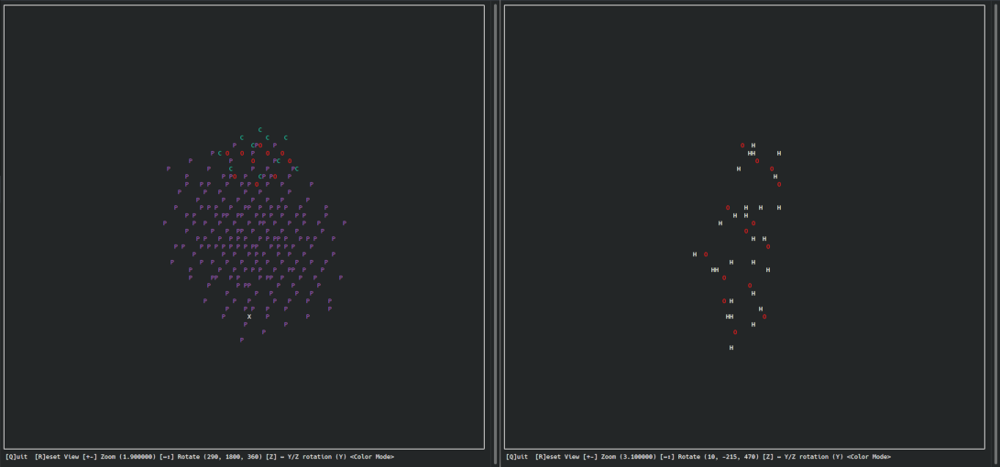

# asciiMOL

A basic molecule viewer written in Python, using curses; Thus, meant for linux terminals.

This is an alpha version, featuring:

* Opening default cartesian .xyz files
* Displaying one-letter atom labels
* Orthographic view
* Zoom, Rotation
* Simple Colors for common light atoms

Planned, but NYI features:
* Automatic bond calculation and display
* Two-letter atom symbols

On the horizon:
* Perspective / Orthographic view toggle
* More formats
* Custom Colors

## Installation

You will need:
* git
* Python 3.8
* setuptools
* numpy

1. Clone the repository using\
`git clone https://github.com/dewberryants/asciiMol.git`

2. Navigate into the folder (containing the setup.py), then run:\
`easy_install . --user`\
which will install the pacakage into your local python site package directory. You can choose to omit the `--user`
flag, however be aware that this might then require root privilege.

3. Use the module by typing:\
`python -m asciimol input.xyz`